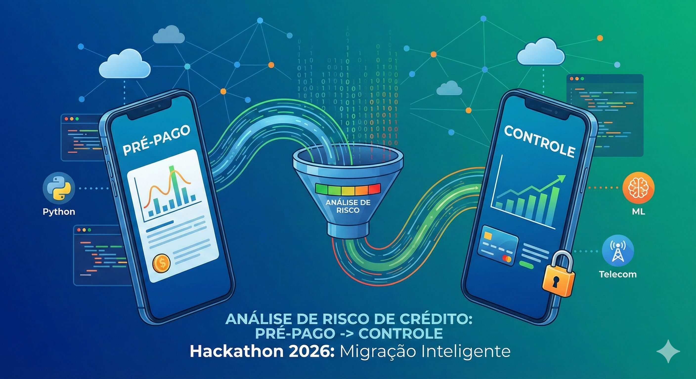
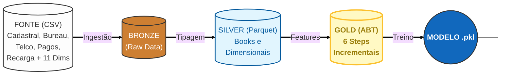

# Hackathon: Risco de Crédito

# Problema de Negócio
Uma grande empresa do setor de telecomunicações busca expandir sua base de clientes em planos de maior valor (Controle) de forma sustentável. O desafio central é equilibrar o crescimento da carteira com uma gestão de risco eficiente, focando na migração de usuários do segmento Pré-pago, que representam a principal porta de entrada de novos clientes.

O objetivo deste projeto é desenvolver um Modelo de Behavior baseado na Visão Unificada do Cliente (CPF) para estimar a probabilidade de inadimplência durante esse processo de migração.

Objetivos Principais:
- Identificar perfis de baixo risco: Localizar clientes pré-pagos com maior potencial de adimplência em planos Controle.

- Otimizar Ofertas: Direcionar propostas de forma mais eficiente e personalizada.

- Rentabilidade: Reduzir o risco de crédito e aumentar a saúde financeira da carteira de clientes.

# Arquitetura

## Detalhamento das Camadas

**1 - Bronze Layer (Ingestão)**
 
`Objetivo`: Armazenamento dos dados brutos em formato .parquet sem alterações de negócio.

- Fontes: Dados internos de telecom (uso, recarga, fatura) e dados externos de Bureau (Score, Negativação).
- Ações: Leitura otimizada (Lazy Evaluation) e validação inicial de schema.

**2 - Silver Layer (Refinamento e Engenharia)**
 
`Objetivo:` Limpeza, padronização e criação de Books de Variáveis (Feature Engineering). 

- Book de Pagamento:
    - Cálculo de dias de atraso (Vencimento vs Pagamento Real).
    - Criação de flags de atraso histórico.
    - Regra de Negócio: Filtro para remover pagamentos futuros à data da safra (prevenção de Data Leakage).

- Book de Recarga:
    - Agregações (Soma, Média, Máximo) de valores recarregados.
    - Clusterização de comportamento (Pré-pago vs Controle).
    - Cálculo de Recência (dias desde a última recarga).
    - Regra de Negócio: Filtro para remover pagamentos futuros à data da safra (prevenção de Data Leakage).

- Módulo Cadastral & Telco:
    - Tratamento de variáveis anonimizadas (var_X).
    - Normalização de categorias de emprego e renda.

**3 - Gold Layer (Agregação Final)**
 
`Objetivo`: Consolidação da Visão 360º do Cliente (ABT) pronta para modelagem.

- Estratégia de Join: Utilização de Left Joins partindo da população alvo (Safra/Cliente).
    - Justificativa: Preservar clientes sem histórico (Recarga/Pagamento) na base, pois a "ausência de informação" é um preditor de risco relevante.

- Tratamento de Nulos:
    - Sentinela -1: Aplicado para missings gerados pelo Join (ex: cliente nunca recarregou).
    - Sentinela -4: Mantido para missings originais da fonte de dados.

- Flags de Metadados: Criação de colunas binárias (ex: PAG_HISTORICO_MISSING) para sinalizar explicitamente ao modelo a origem da ausência do dado.

**Tecnologias Utilizadas**
 

 

 

 

