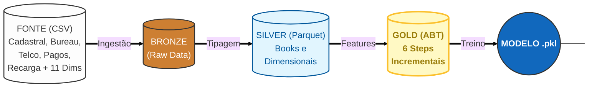

# Hackathon: Risco de Crédito

# Problema de Negócio
Uma grande empresa do setor de telecomunicações busca expandir sua base de clientes em planos de maior valor (Controle) de forma sustentável. O desafio central é equilibrar o crescimento da carteira com uma gestão de risco eficiente, focando na migração de usuários do segmento Pré-pago, que representam a principal porta de entrada de novos clientes.

O objetivo deste projeto é desenvolver um Modelo de Behavior baseado na Visão Unificada do Cliente (CPF) para estimar a probabilidade de inadimplência durante esse processo de migração.

Objetivos Principais:
- Identificar perfis de baixo risco: Localizar clientes pré-pagos com maior potencial de adimplência em planos Controle.

- Otimizar Ofertas: Direcionar propostas de forma mais eficiente e personalizada.

- Rentabilidade: Reduzir o risco de crédito e aumentar a saúde financeira da carteira de clientes.

# Arquitetura

