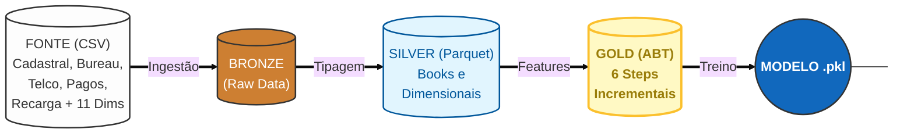
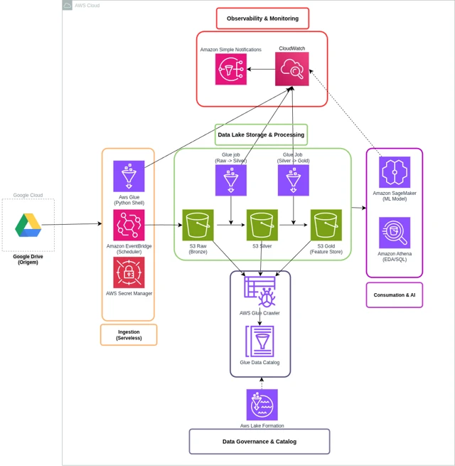

# Hackathon: Risco de Crédito


# Problema de Negócio
Uma grande empresa do setor de telecomunicações busca expandir sua base de clientes em planos de maior valor (Controle) de forma sustentável. O desafio central é equilibrar o crescimento da carteira com uma gestão de risco eficiente, focando na migração de usuários do segmento Pré-pago, que representam a principal porta de entrada de novos clientes.

O objetivo deste projeto é desenvolver um Modelo de Behavior baseado na Visão Unificada do Cliente (CPF) para estimar a probabilidade de inadimplência durante esse processo de migração.

Objetivos Principais:
- Identificar perfis de baixo risco: Localizar clientes pré-pagos com maior potencial de adimplência em planos Controle.

- Otimizar Ofertas: Direcionar propostas de forma mais eficiente e personalizada.

- Rentabilidade: Reduzir o risco de crédito e aumentar a saúde financeira da carteira de clientes.

# Arquitetura

## Detalhamento das Camadas

**1 - Bronze Layer (Ingestão)**
<br>
`Objetivo`: Armazenamento dos dados brutos em formato .parquet sem alterações de negócio.

- Fontes: Dados internos de telecom (uso, recarga, fatura) e dados externos de Bureau (Score, Negativação).
- Ações: Leitura otimizada (Lazy Evaluation) e validação inicial de schema.

**2 - Silver Layer (Refinamento e Engenharia)**
<br>
`Objetivo:` Limpeza, padronização e criação de Books de Variáveis (Feature Engineering). 

- Book de Pagamento:
    - Cálculo de dias de atraso (Vencimento vs Pagamento Real).
    - Criação de flags de atraso histórico.
    - Regra de Negócio: Filtro para remover pagamentos futuros à data da safra (prevenção de Data Leakage).

- Book de Recarga:
    - Agregações (Soma, Média, Máximo) de valores recarregados.
    - Clusterização de comportamento (Pré-pago vs Controle).
    - Cálculo de Recência (dias desde a última recarga).
    - Regra de Negócio: Filtro para remover pagamentos futuros à data da safra (prevenção de Data Leakage).

- Módulo Cadastral & Telco:
    - Tratamento de variáveis anonimizadas (var_X).
    - Normalização de categorias de emprego e renda.

**3 - Gold Layer (Agregação Final)**
<br>
`Objetivo`: Consolidação da Visão 360º do Cliente (ABT) pronta para modelagem.

- Estratégia de Join: Utilização de Left Joins partindo da população alvo (Safra/Cliente).
    - Justificativa: Preservar clientes sem histórico (Recarga/Pagamento) na base, pois a "ausência de informação" é um preditor de risco relevante.

- Tratamento de Nulos:
    - Sentinela -1: Aplicado para missings gerados pelo Join (ex: cliente nunca recarregou).
    - Sentinela -4: Mantido para missings originais da fonte de dados.

- Flags de Metadados: Criação de colunas binárias (ex: PAG_HISTORICO_MISSING) para sinalizar explicitamente ao modelo a origem da ausência do dado.

**Tecnologias Utilizadas**
<br>

<br>

<br>

<br>


## Arquitetura de Dados Proposta (AWS Cloud)


A arquitetura proposta foi desenhada seguindo os pilares do `AWS Well-Architected Framework`, priorizando uma abordagem `Serverless (sem servidor)`. Isso garante que o foco do time esteja na lógica de negócio e na ciência de dados, delegando o gerenciamento de infraestrutura para a AWS, o que resulta em maior eficiência operacional, escalabilidade automática e otimização de custos.

O fluxo de dados segue a arquitetura de referência `"Medalhão" (Bronze/Silver/Gold)`, garantindo a qualidade, rastreabilidade e governança dos dados desde a ingestão até a modelagem preditiva.

**1 - Ingestão e Orquestração (Ingestion Layer)**

- `Ferramentas`: AWS Glue Python Shell, Amazon EventBridge, AWS Secrets Manager.
- `Como funciona`: O processo inicia-se com uma rotina agendada no Amazon EventBridge, que dispara um script de ingestão no AWS Glue Python Shell. Este script conecta-se ao Google Drive, baixa os arquivos de origem e os deposita na camada crua. **O encadeamento das etapas subsequentes é gerenciado nativamente, garantindo que a transformação só inicie após o sucesso da ingestão.**
- `Motivo da Escolha`:
    - `AWS Glue Python Shell`: Escolhido em detrimento do AWS Lambda para eliminar o risco de timeout (limite de 15 min) e estouro de memória ao processar arquivos volumosos, garantindo robustez para grandes cargas de dados.
    - `Amazon EventBridge`: Desacopla o agendamento da execução, permitindo uma arquitetura orientada a eventos.
    - `AWS Secrets Manager`: Elimina credenciais hardcoded, garantindo que chaves de API trafeguem criptografadas e em conformidade com normas de segurança.

**2 - Armazenamento e Data Lake (Storage Layer)**

- `Ferramentas`: Amazon S3 (Buckets Raw, Silver, Gold).
- `Como funciona`: O Amazon S3 atua como o repositório central com três estágios lógicos (Bronze/Silver/Gold).
    - `Raw`: Dados brutos e imutáveis (Auditabilidade).
    - `Silver`: Dados limpos e convertidos para Parquet com compressão Snappy, otimizando performance de I/O.
    - `Gold`: Dados agregados (Feature Store) prontos para o modelo.
- `Motivo da Escolha`: Além da durabilidade de "11 noves", o S3 permite aplicar **Lifecycle Policies (Políticas de Ciclo de Vida)** para mover dados antigos para classes de armazenamento mais baratas (Glacier) automaticamente, atendendo ao pilar de Otimização de Custos.

**3 - Processamento e Transformação (Processing Layer)**

- `Ferramentas`: AWS Glue Jobs (Spark).
- `Como funciona`: Jobs Spark processam os dados de forma distribuída.
- `Motivo da Escolha`: O AWS Glue é totalmente gerenciado. A escolha pelo Spark permite processamento paralelo massivo, essencial para recalcular o score de milhões de clientes em minutos, garantindo `escalabilidade horizontal` transparente.

**4 - Governança e Catálogo (Data Governance)**

- `Ferramentas`: AWS Glue Crawler, AWS Glue Data Catalog, AWS Lake Formation.
- `Como funciona`: O Crawler infere esquemas automaticamente (Schema Evolution) e o Lake Formation gerencia o acesso.
- `Motivo da Escolha`:
    - `AWS Lake Formation`: É o diferencial de segurança do projeto. Ele permite implementar **segurança a nível de linha e coluna (ex: mascarar o CPF e Renda para analistas júnior)**, garantindo conformidade estrita com a **LGPD** sem necessidade de duplicar dados anonimizados.

**5 - Consumo, Analytics e Machine Learning**

- `Ferramentas`: Amazon Athena, Amazon SageMaker.
- `Como funciona`: O Athena permite SQL ad-hoc e o SageMaker gerencia o ciclo de vida do modelo.
- `Motivo da Escolha`:
    - `Amazon Athena`: Custo zero de infraestrutura fixa, pagando apenas por terabyte scaneado.
    - `Amazon SageMaker`: Além do treinamento, utilizamos o **SageMaker Model Registry** para versionar os artefatos do modelo (.pkl), garantindo que saibamos exatamente qual versão do modelo gerou qual score, assegurando a reprodutibilidade científica.

**6 - Observabilidade e Operações (Ops & Monitoring)**

- `Ferramentas`: Amazon CloudWatch, Amazon SNS.
- `Como funciona`: Monitoramento centralizado de logs, métricas e alarmes.
`Motivo da Escolha`: Atende ao pilar de Excelência Operacional. A configuração de alarmes no CloudWatch integrados ao SNS permite uma abordagem **proativa**: o time é notificado sobre falhas de pipeline ou degradação de performance antes que o negócio seja impactado.


---

# Ciência de Dados: Instalação e Execução

Esta seção descreve como preparar os dados e executar os pipelines de modelagem da pasta `data_science/`.

## 1) Estrutura esperada da pasta `data/`

Os scripts de exemplo (`data_science/exemplo_treinamento.py` e `data_science/treinar_histgb.py`) procuram os dados em:

```text
<raiz-do-projeto>/data
```

Dentro de `data/`, organize os dados em **subpastas** com os nomes:

- `score_01`
- `score_02`
- `plus_telco`
- `plus_cadastral`
- `plus_recarga`
- `plus_pagamento`

> Observação: para rodar o fluxo incremental completo com todas as etapas padrão (1 a 6), também é esperado o conjunto da etapa cadastral (`plus_cadastral`).

Cada subpasta pode conter arquivos `.csv` e/ou `.parquet`.

Exemplo de layout:

```text
Hackathon-claro-squad-06/
├── data/
│   ├── score_01/
│   ├── score_02/
│   ├── plus_telco/
│   ├── plus_cadastral/
│   ├── plus_recarga/
│   └── plus_pagamento/
└── data_science/
```

## 2) Modo recomendado: `uv`

Use `uv` como forma principal de instalação e execução.

### 2.1) Instalar dependências

Na raiz do projeto:

```bash
uv sync
```

### 2.2) Rodar o exemplo completo (LR + GB + comparação)

```bash
uv run python data_science/exemplo_treinamento.py
```

Esse script executa:

- carregamento dos dados,
- split treino/OOT,
- treino incremental com Regressão Logística,
- treino incremental com Gradient Boosting,
- comparação entre modelos,
- salvamento dos resultados e gráficos.

### 2.3) Rodar o exemplo focado em HistGradientBoosting

```bash
uv run python data_science/treinar_histgb.py
```

Esse script executa:

- carregamento dos dados,
- split treino/OOT,
- treino incremental com HistGradientBoosting,
- salvamento de resultados,
- exportação de matriz de confusão consolidada,
- exportação do modelo final (`.pkl`).

## 3) Modo alternativo: `pip`

Se você preferir não usar `uv`, rode com `pip` usando o `requirements.txt`.

### 3.1) Criar e ativar ambiente virtual

```bash
python -m venv .venv
```

Ative o ambiente virtual:

- Windows (PowerShell):

```bash
.venv\Scripts\Activate.ps1
```

- Windows (cmd):

```bash
.venv\Scripts\activate.bat
```

### 3.2) Instalar e executar

```bash
python -m pip install -r requirements.txt
python data_science/exemplo_treinamento.py
python data_science/treinar_histgb.py
```

## 4) Logs e outputs

Durante a execução, arquivos e diretórios de saída são gerados automaticamente, como:

- `logs/` (arquivos de log)
- `output/` (resultados CSV, gráficos KS, modelo salvo etc.)

Essas pastas são criadas no **diretório de execução** (diretório atual de onde o comando é rodado).
