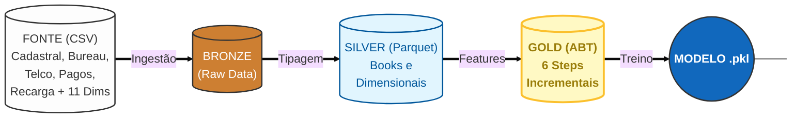
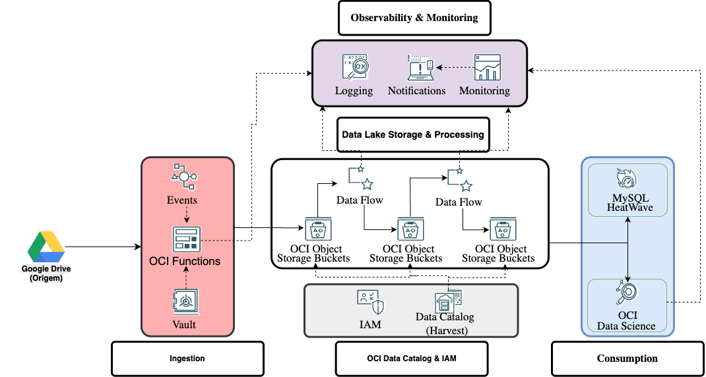
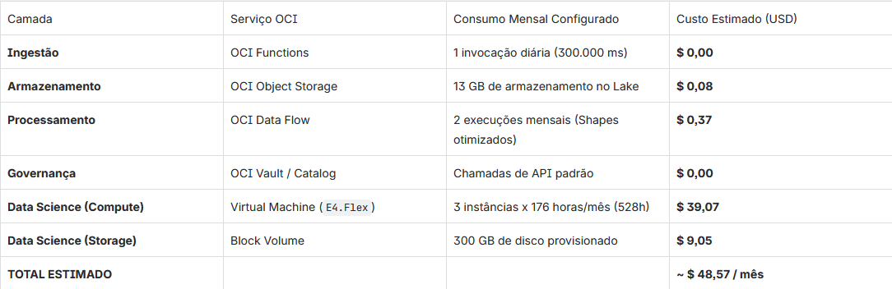

# Hackathon: Risco de Crédito


# Problema de Negócio
Uma grande empresa do setor de telecomunicações busca expandir sua base de clientes em planos de maior valor (Controle) de forma sustentável. O desafio central é equilibrar o crescimento da carteira com uma gestão de risco eficiente, focando na migração de usuários do segmento Pré-pago, que representam a principal porta de entrada de novos clientes.

O objetivo deste projeto é desenvolver um Modelo de Behavior baseado na Visão Unificada do Cliente (CPF) para estimar a probabilidade de inadimplência durante esse processo de migração.

Objetivos Principais:
- Identificar perfis de baixo risco: Localizar clientes pré-pagos com maior potencial de adimplência em planos Controle.

- Otimizar Ofertas: Direcionar propostas de forma mais eficiente e personalizada.

- Rentabilidade: Reduzir o risco de crédito e aumentar a saúde financeira da carteira de clientes.

# Arquitetura

## Detalhamento das Camadas

**1 - Bronze Layer (Ingestão)**
<br>
`Objetivo`: Armazenamento dos dados brutos em formato .parquet sem alterações de negócio.

- Fontes: Dados internos de telecom (uso, recarga, fatura) e dados externos de Bureau (Score, Negativação).
- Ações: Leitura otimizada (Lazy Evaluation) e validação inicial de schema.

**2 - Silver Layer (Refinamento e Engenharia)**
<br>
`Objetivo:` Limpeza, padronização e criação de Books de Variáveis (Feature Engineering). 

- Book de Pagamento:
    - Cálculo de dias de atraso (Vencimento vs Pagamento Real).
    - Criação de flags de atraso histórico.
    - Regra de Negócio: Filtro para remover pagamentos futuros à data da safra (prevenção de Data Leakage).

- Book de Recarga:
    - Agregações (Soma, Média, Máximo) de valores recarregados.
    - Clusterização de comportamento (Pré-pago vs Controle).
    - Cálculo de Recência (dias desde a última recarga).
    - Regra de Negócio: Filtro para remover pagamentos futuros à data da safra (prevenção de Data Leakage).

- Módulo Cadastral & Telco:
    - Tratamento de variáveis anonimizadas (var_X).
    - Normalização de categorias de emprego e renda.

**3 - Gold Layer (Agregação Final)**
<br>
`Objetivo`: Consolidação da Visão 360º do Cliente (ABT) pronta para modelagem.

- Estratégia de Join: Utilização de Left Joins partindo da população alvo (Safra/Cliente).
    - Justificativa: Preservar clientes sem histórico (Recarga/Pagamento) na base, pois a "ausência de informação" é um preditor de risco relevante.

- Tratamento de Nulos:
    - Sentinela -1: Aplicado para missings gerados pelo Join (ex: cliente nunca recarregou).
    - Sentinela -4: Mantido para missings originais da fonte de dados.

- Flags de Metadados: Criação de colunas binárias (ex: PAG_HISTORICO_MISSING) para sinalizar explicitamente ao modelo a origem da ausência do dado.

**Notebooks**
<br>
[Tratamento Inicial](notebooks/Broze-Silver_EMR.ipynb)
<br>
[Baseline](notebooks/Baseline_Colab.ipynb )

**Tecnologias Utilizadas**
<br>

<br>

<br>

<br>


# Arquitetura de Dados: Behavior Score na Oracle Cloud (OCI)
1. Visão Geral da Solução

A arquitetura proposta foi desenhada na Oracle Cloud Infrastructure (OCI) seguindo as melhores práticas de Cloud Native e o pilar de Otimização de Custos (FinOps). O projeto adota uma abordagem 100% Serverless orientada a eventos, combinada com o padrão Lakehouse (Medalhão). Isso garante escalabilidade horizontal transparente, segurança "by design" e um modelo de cobrança estritamente pay-as-you-go (pague pelo uso).



## 2. Detalhamento da Arquitetura por Camada

### A. Ingestão Segura e Serverless (Ingestion Layer)

* **Serviços OCI:** Events, Functions, Vault.

* **Como funciona:**
O pipeline é totalmente automatizado. O OCI Events atua como gatilho (cron) que invoca o OCI Functions. Para garantir conformidade de segurança e eliminar credenciais hardcoded, a função utiliza **Resource Principals** para buscar a chave do Google Drive criptografada no OCI Vault. Em seguida, realiza a carga incremental dos dados, depositando-os no Data Lake.

### B. Data Lake e Processamento (Storage & Processing Layer)

* **Serviços OCI:** Object Storage, Data Flow.

* **Como funciona:**
Os dados fluem por três estágios lógicos no OCI Object Storage:

    * **Bronze (Raw):** dados brutos ingeridos (~5.33 GiB).
    * **Silver (Cleaned):** dados higienizados e convertidos para Parquet (~5.14 GiB fragmentados em 943 objetos).
    * **Gold (Feature Store):** dados agregados prontos para consumo (~1.72 GiB).

* **O motor de ETL:**
A transformação entre as camadas é feita pelo OCI Data Flow (Apache Spark 100% gerenciado). Ele processa a volumetria de forma distribuída e desliga a infraestrutura imediatamente após a conclusão.

### C. Governança e Segurança (Data Catalog & IAM)

* **Serviços OCI:** Data Catalog, IAM.

* **Como funciona:**
O OCI Data Catalog realiza o **Harvesting automático**, inferindo os esquemas do Object Storage para garantir que os dados sejam descobríveis. O OCI IAM aplica políticas de acesso granular (RBAC), garantindo que apenas os serviços autorizados e os cientistas acessem a Feature Store.

### D. Consumo e Machine Learning (Consumption Layer)

* **Serviços OCI:** MySQL HeatWave, Data Science.

* **Como funciona:**
O MySQL HeatWave permite consultas SQL analíticas de alta performance diretamente no Object Storage. Em paralelo, o OCI Data Science consome a camada Gold para o treinamento e inferência do modelo de Machine Learning (**Behavior Score**).

### E. Observabilidade Proativa (Observability & Monitoring)

* **Serviços OCI:** Logging, Monitoring, Notifications.

* **Como funciona:**
Toda a telemetria do Functions e do Data Flow é enviada para a central de observabilidade. O OCI Logging retém os rastreios de execução, enquanto o OCI Monitoring avalia o *health* da esteira. Qualquer falha nos jobs aciona o OCI Notifications, que alerta a engenharia proativamente.

---

## 3. Estratégia de Infraestrutura e FinOps

Uma arquitetura madura não é apenas funcional, mas também financeiramente otimizada.

### Otimização do OCI Data Flow (Apache Spark)

* **Cenário inicial:**
O job `Job_Bronze_to_Silver` utilizava uma máquina `VM.Standard.E4.Flex` com **4 OCPUs** e **32 GB de RAM**.

* **Ajuste FinOps:**
Para processar a volumetria mensal de ~12.2 GiB, essa máquina estava superdimensionada. Reduzimos o *shape* na estimativa final para:

    * **Driver:** 2 OCPUs e 16 GB de RAM.
    * **Executors:** 2 instâncias de 1 OCPU e 8 GB de RAM cada.

    * **Justificativa:**
Essa configuração lida com o volume atual com extrema folga, mitigando o problema de *Small Files* (visto na camada Silver) e derrubando o custo computacional do ETL para centavos de dólar.

### Dimensionamento do OCI Data Science

* **Cenário:**
Equipe de 3 Cientistas de Dados trabalhando em horário comercial (**176 horas mensais cada**).

* **Ajuste FinOps:**
Configuramos 3 instâncias separadas, para evitar concorrência de kernel e garantir governança individual, operando por 176 horas úteis. O serviço conta com **Auto-Deactivation** para desligar as instâncias ociosas (por exemplo, finais de semana), garantindo que pagaremos apenas por **528 horas totais no mês**, e não pelas horas ociosas.

---

## 4. Total Cost of Ownership (TCO) Mensal Estimado

A tabela abaixo detalha a estimativa de custos para o processamento de toda a rotina mensal, com base na calculadora oficial da OCI.



**Conclusão de negócio:**

> Nossa arquitetura prova matematicamente o valor do modelo *serverless* na nuvem Oracle. Toda a nossa esteira de ingestão, armazenamento e ETL do Lakehouse tem custo quase nulo (~US$ 0,45/mês). O investimento de ~US$ 48 foca exclusivamente no que gera valor para o negócio: a infraestrutura computacional para nossos cientistas de dados treinarem o Behavior Score.


---

# Ciência de Dados: Instalação e Execução

Esta seção descreve como preparar os dados e executar os pipelines de modelagem da pasta `data_science/`.

## 1) Estrutura esperada da pasta `data/`

Os scripts de exemplo (`data_science/exemplo_treinamento.py` e `data_science/treinar_histgb.py`) procuram os dados em:

```text
<raiz-do-projeto>/data
```

Dentro de `data/`, organize os dados em **subpastas** com os nomes:

- `score_01`
- `score_02`
- `plus_telco`
- `plus_cadastral`
- `plus_recarga`
- `plus_pagamento`

> Observação: para rodar o fluxo incremental completo com todas as etapas padrão (1 a 6), também é esperado o conjunto da etapa cadastral (`plus_cadastral`).

Cada subpasta pode conter arquivos `.csv` e/ou `.parquet`.

Exemplo de layout:

```text
Hackathon-claro-squad-06/
├── data/
│   ├── score_01/
│   ├── score_02/
│   ├── plus_telco/
│   ├── plus_cadastral/
│   ├── plus_recarga/
│   └── plus_pagamento/
└── data_science/
```

## 2) Modo recomendado: `uv`

Use `uv` como forma principal de instalação e execução.

### 2.1) Instalar dependências

Na raiz do projeto:

```bash
uv sync
```

### 2.2) Rodar o exemplo completo (LR + GB + comparação)

```bash
uv run python data_science/exemplo_treinamento.py
```

Esse script executa:

- carregamento dos dados,
- split treino/OOT,
- treino incremental com Regressão Logística,
- treino incremental com Gradient Boosting,
- comparação entre modelos,
- salvamento dos resultados e gráficos.

### 2.3) Rodar o exemplo focado em HistGradientBoosting

```bash
uv run python data_science/treinar_histgb.py
```

Esse script executa:

- carregamento dos dados,
- split treino/OOT,
- treino incremental com HistGradientBoosting,
- salvamento de resultados,
- exportação de matriz de confusão consolidada,
- exportação do modelo final (`.pkl`).

## 3) Modo alternativo: `pip`

Se você preferir não usar `uv`, rode com `pip` usando o `requirements.txt`.

### 3.1) Criar e ativar ambiente virtual

```bash
python -m venv .venv
```

Ative o ambiente virtual:

- Windows (PowerShell):

```bash
.venv\Scripts\Activate.ps1
```

- Windows (cmd):

```bash
.venv\Scripts\activate.bat
```

### 3.2) Instalar e executar

```bash
python -m pip install -r requirements.txt
python data_science/exemplo_treinamento.py
python data_science/treinar_histgb.py
```

## 4) Logs e outputs

Durante a execução, arquivos e diretórios de saída são gerados automaticamente, como:

- `logs/` (arquivos de log)
- `output/` (resultados CSV, gráficos KS, modelo salvo etc.)

Essas pastas são criadas no **diretório de execução** (diretório atual de onde o comando é rodado).
